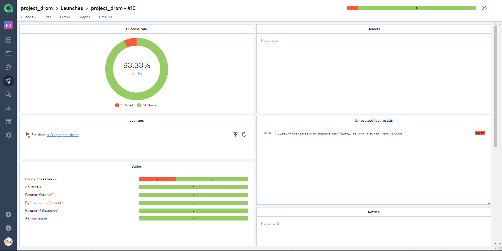
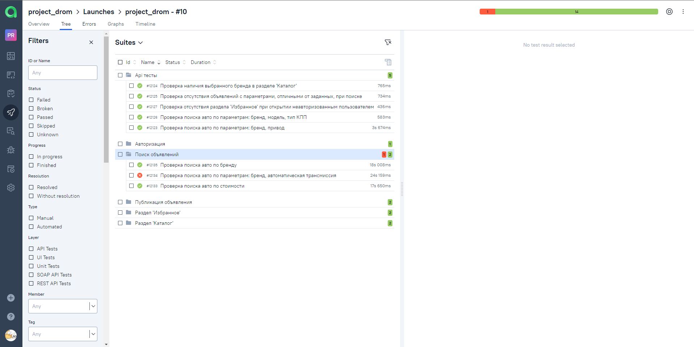
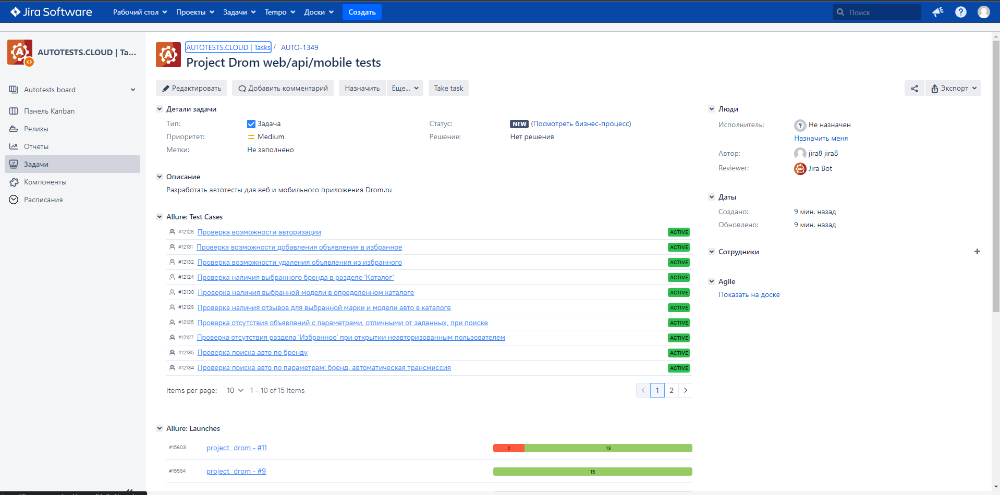
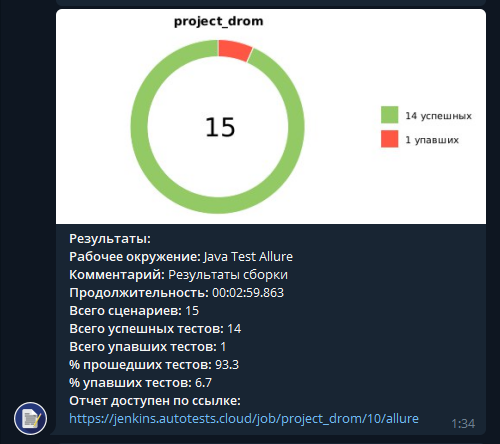

# Дипломный проект по автоматизации тестирования сайта и мобильного приложения Drom.ru


## :page_with_curl:	Содержание

> :heavy_check_mark: [Технологии и инструменты](#technologist-технологии-и-инструменты)
>
> :heavy_check_mark: [Реализованы проверки](#bookmark_tabs-реализованы-проверки)
>
> :heavy_check_mark: [Запуск тестов из терминала](#computer-Запуск-тестов-из-терминала)
>
> :heavy_check_mark: [Запуск тестов в Jenkins](#-запуск-тестов-в-jenkins)
>
> :heavy_check_mark: [Отчет о результатах тестирования в Allure Report](#-отчет-о-результатах-тестирования-в-allure-report)
>
> :heavy_check_mark: [Интеграция с Allure TestOps](#-интеграция-с-allure-testops)
>
> :heavy_check_mark: [Интеграция с Jira](#-интеграция-с-jira)
>
> :heavy_check_mark: [Уведомления в Telegram с использованием бота](#-уведомления-в-telegram-с-использованием-бота)
>
> :heavy_check_mark: [Пример запуска теста в Selenoid](#-пример-запуска-теста-в-selenoid)

## :technologist: Технологии и инструменты

<p  align="center">


</p>

> *В данном проекте автотесты написаны на <code><strong>*Java*</strong></code> с использованием фреймворка <code><strong>*Selenide*</strong></code> для UI-тестов и <code><strong>*RestAssured*</strong></code> для Api-тестов.*
>
>*Для сборки проекта используется <code><strong>*Gradle*</strong></code>.*
>
>*<code><strong>*JUnit 5*</strong></code> используется как фреймворк для модульного тестирования.*
>
>*Запуск тестов выполняется из <code><strong>*Jenkins*</strong></code>.*
>
>*<code><strong>*Selenoid*</strong></code> используется для запуска браузеров в контейнерах  <code><strong>*Docker*</strong></code>.*
>
>*<code><strong>*Allure Report, Allure TestOps, Jira, Telegram Bot*</strong></code> используются для визуализации результатов тестирования.*
>
>*Для запуска мобильных тестов используется <code><strong>*Android studio*</strong></code> и <code><strong>*Browserstack*</strong></code>.*


## :bookmark_tabs: Реализованы проверки

### &nbsp;&nbsp;&nbsp;&nbsp;&nbsp;&nbsp; Web

> - [x] *Проверка возможности авторизации*
>- [x] *Проверка наличия выбранной модели в определенном каталоге*
>- [x] *Проверка наличия отзывов для выбранной марки и модели авто в каталоге*
>- [x] *Проверка возможности добавления объявления в избранное*
>- [x] *Проверка возможности удаления объявления из избранного*
>- [x] *Проверка поиска авто по бренду*
>- [x] *Проверка поиска авто по стоимости*
>- [x] *Проверка поиска авто по параметрам: бренд, автоматическая трансмиссия*
>- [x] *Проверка сообщения об отсутствии номера при заполнении объявления*
>- [x] *Проверка сообщения об отсутствии стоимости при заполнении объявления*

### &nbsp;&nbsp;&nbsp;&nbsp;&nbsp;&nbsp; API

> - [x] *Проверка поиска авто по параметрам: бренд, модель, тип КПП*
>- [x] *Проверка поиска авто по параметрам: бренд, привод*
>- [x] *Проверка отсутствия объявлений с параметрами, отличными от заданных, при поиске*
>- [x] *Проверка отсутствия раздела 'Избранное' при открытии неавторизованным пользователем*
>- [x] *Проверка наличия выбранного бренда в разделе 'Каталог'*

### &nbsp;&nbsp;&nbsp;&nbsp;&nbsp;&nbsp; Mobile

> - [x] *Проверка возможности авторизации*
> - [x] *Проверка поиска авто по выбранному бренд*
>- [x] *Проверка возможности добавления авто в раздел 'Избранное'*


## :computer: Запуск тестов из терминала

### Локальный запуск тестов

```bash
gradle clean web -Dhost=local - ui тесты
gradle clean api -Dhost=local - api тесты
gradle clean mobile -DdeviceHost=realDevice - тесты мобильного приложения на физическом девайсе
gradle clean mobile -DdeviceHost=local - тесты мобильного приложения в эмуляторе AndroidStudio
gradle clean webAndApi -Dhost=local - ui + api тесты

(host=remote по умолчанию)
(deviceHost=browserstack по умолчанию)
```

### Удаленный запуск тестов

```bash
gradle clean web -Dhost=remote - ui тесты
gradle clean api -Dhost=remote - api тесты
gradle clean mobile -DdeviceHost=browserstack - тесты мобильного приложения на сервере Browserstack
gradle clean webAndApi -Dhost=remote - ui + api тесты
```

### Параметры сборки

>
> <code>browser</code> – браузер, в котором будут выполняться тесты (_по умолчанию - <code>chrome</code>_).
>
> <code>browserVersion</code> – версия браузера, в которой будут выполняться тесты (_по умолчанию - <code>100</code>_).
>
> <code>browserSize</code> – размер окна браузера, в котором будут выполняться тесты (_по умолчанию - <code>1920x1080</code>_).

##  Запуск тестов в [Jenkins](https://jenkins.autotests.cloud/job/project_drom/)

*Для запуска сборки необходимо указать значения параметров и нажать кнопку <code><strong>*Собрать*</strong></code>.*

<p align="center">
  
</p>

*После выполнения сборки, в блоке <code><strong>*История сборок*</strong></code> напротив номера сборки появится
значок <code><strong>*Allure
Report*</strong></code>, кликнув по которому, откроется страница с сформированным html-отчетом.*

<p align="center">
  
</p>

##  Отчет о результатах тестирования в [Allure Report](https://jenkins.autotests.cloud/job/project_drom/9/allure/)

### :pushpin: Общая информация

*Главная страница Allure-отчета содержит следующие информационные блоки:*

> - [x] <code><strong>*ALLURE REPORT*</strong></code> - отображает дату и время прохождения теста, общее количество прогнанных кейсов, а также диаграмму с указанием процента и количества успешных, упавших и сломавшихся в процессе выполнения тестов
>- [x] <code><strong>*TREND*</strong></code> - отображает тренд прохождения тестов от сборки к сборке
>- [x] <code><strong>*SUITES*</strong></code> - отображает распределение результатов тестов по тестовым наборам
>- [x] <code><strong>*ENVIRONMENT*</strong></code> - отображает тестовое окружение, на котором запускались тесты (в данном случае информация не задана)
>- [x] <code><strong>*CATEGORIES*</strong></code> - отображает распределение неуспешно прошедших тестов по видам дефектов
>- [x] <code><strong>*FEATURES BY STORIES*</strong></code> - отображает распределение тестов по функционалу, который они проверяют
>- [x] <code><strong>*EXECUTORS*</strong></code> - отображает исполнителя текущей сборки (ссылка на сборку в Jenkins)

<p align="center">
  
</p>

### :pushpin: Тесты
<p align="center">
  
</p>

##  Интеграция с [Allure TestOps](https://allure.autotests.cloud/launch/15585)

### :pushpin: Основной дашборд

<p align="center">
  
</p>

### :pushpin: Тест-кейсы

<p align="center">
  
</p>

##  Интеграция с [Jira](https://jira.autotests.cloud/browse/AUTO-1349)

<p align="center">
  
</p>


##  Уведомления в Telegram с использованием бота

> После завершения сборки специальный бот, созданный в <code>Telegram</code>, автоматически обрабатывает и отправляет сообщение с отчетом о прогоне тестов.

<p align="center">

</p>

##  Пример запуска теста в Selenoid

> К каждому тесту в отчете прилагается видео.
<p align="center">
  
</p>

